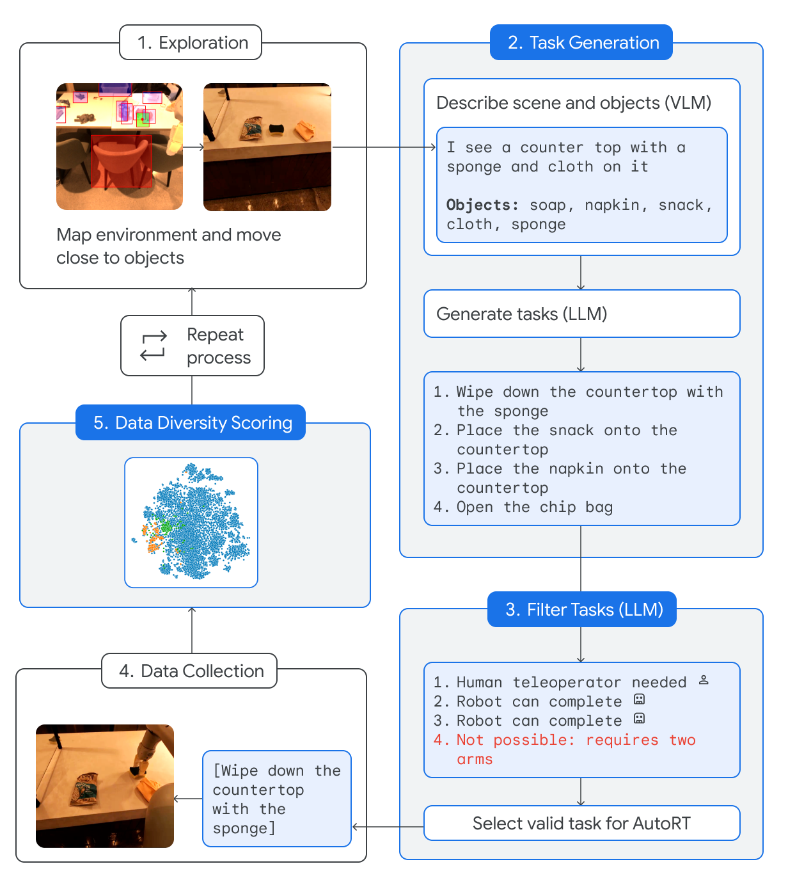

[](https://discord.gg/qUtxnK2NMf)

# AutoRT

Implementation of AutoRT: "AutoRT: Embodied Foundation Models for Large Scale Orchestration of Robotic Agents". This repo will implement the multi agent system that transforms a scene into a list of ranked and priortized tasks for an robotic action model to execute. This is an very effective setup that I personally believe is the future for swarming robotic foundation models!

This project will be implemented using Swarms, for the various llms and use the official RT-1 as the robotic action model.

[PAPER LINK](https://auto-rt.github.io/static/pdf/AutoRT.pdf)

## Install
`$ pip3 install autort-swarms`


## Usage


### AutoRTAgent
A single AutoRT agent that: analyzes a scene using visual COT -> generate tasks -> filter tasks -> execute it with a robotic transformer.
```python
# Import necessary modules
import os
from autort import AutoRTSwarm, AutoRTAgent

# Set the OpenAI API key
openai_api_key = os.getenv("OPENAI_API_KEY")

# Define a list of AutoRTAgent instances
agents = [
    AutoRTAgent(openai_api_key, max_tokens=1000),
    AutoRTAgent(openai_api_key, max_tokens=1000),
]

# Create an instance of AutoRTSwarm with the agents and datastore
autort_swarm = AutoRTSwarm(agents)

# Run the AutoRTSwarm with the given inputs
autort_swarm.run(
    "There is a bottle on the table.",
    "https://i.imgur.com/2qY9f8U.png",
)
```


### AutoRTSwarm
A team of AutoRT agents where you can plug in and play any number of `AutoRTAgents` with customization. First, the task will be routed to each agent and then all of their outputs will be saved.
```python
# Import necessary modules
import os
from autort import AutoRTSwarm, AutoRTAgent

# Set the OpenAI API key
openai_api_key = os.getenv("OPENAI_API_KEY")

# Define a list of AutoRTAgent instances
agents = [
    AutoRTAgent(openai_api_key, max_tokens=1000),
    AutoRTAgent(openai_api_key, max_tokens=1000),
]

# Create an instance of AutoRTSwarm with the agents and datastore
autort_swarm = AutoRTSwarm(agents)

# Run the AutoRTSwarm with the given inputs
autort_swarm.run(
    "There is a bottle on the table.",
    "https://i.imgur.com/2qY9f8U.png",
)
```

## Citation
```bibtex
@inproceedings{
    anonymous2023autort,
    title={Auto{RT}: Embodied Foundation Models for Large Scale Orchestration of Robotic Agents},
    author={Anonymous},
    booktitle={Submitted to The Twelfth International Conference on Learning Representations},
    year={2023},
    url={https://openreview.net/forum?id=xVlcbh0poD},
    note={under review}
}

```


# License
MIT


# Todo
- [ ] Implement a run method into `AutoRTSwarm` that runs all the agents with APIs.
- [ ] Make it able to send commands to a certain agent using the swarm network.
- [ ] Send a task to all agents in the swarm network
- [ ] 